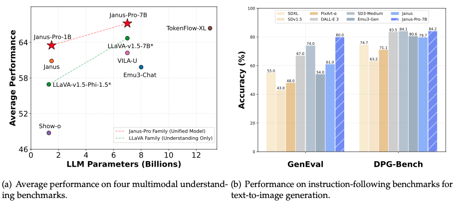
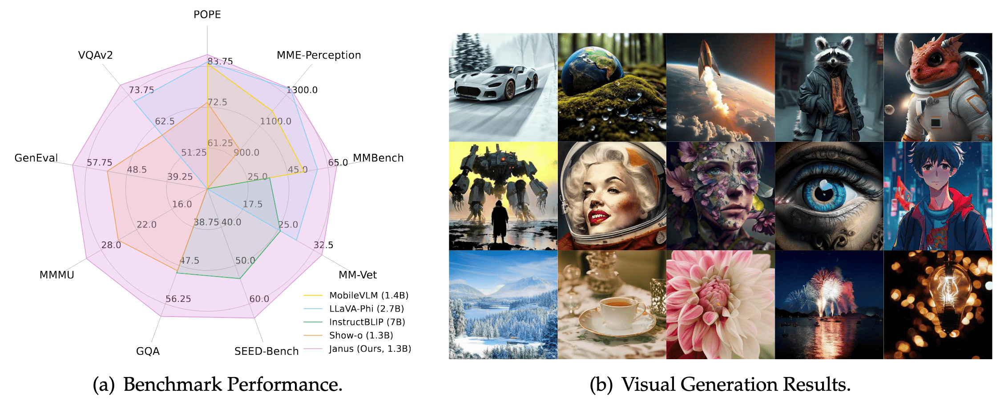
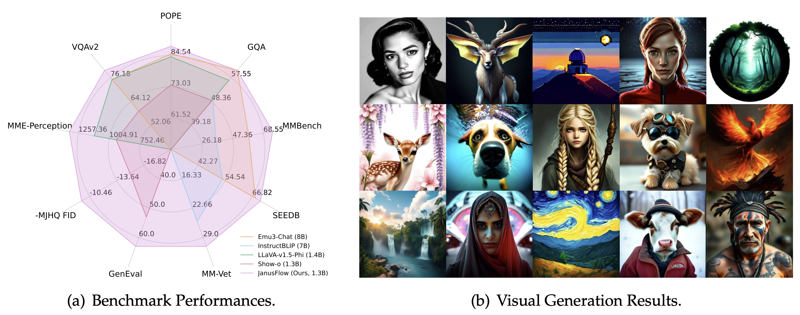

<!-- markdownlint-disable first-line-h1 -->
<!-- markdownlint-disable html -->
<!-- markdownlint-disable no-duplicate-header -->

<div align="center">
  
</div>
<hr>

<div align="center">
<h1>🚀 Janus-Series: Unified Multimodal Understanding and Generation Models</h1>

</div>

<div align="center">

  <a href="https://www.deepseek.com/" target="_blank">
    
  </a>
  </a>
  <a href="https://huggingface.co/deepseek-ai" target="_blank">
    
  </a>

</div>


<div align="center">

  <!-- <a href="https://discord.gg/Tc7c45Zzu5" target="_blank">
    
  </a> -->
  <!-- <a href="images/qr.jpeg" target="_blank">
    
  </a> -->
  <!-- <a href="https://twitter.com/deepseek_ai" target="_blank">
    
  </a> -->

</div>

<div align="center">

  <a href="LICENSE-CODE">
    
  </a>
  <a href="LICENSE-MODEL">
    
  </a>
</div>


<p align="center">
  <a href="#2-model-download"><b>📥 Model Download</b></a> |
  <a href="#3-quick-start"><b>⚡ Quick Start</b></a> |
  <a href="#4-license"><b>📜 License</b></a> |
  <a href="#5-citation"><b>📖 Citation</b></a> <br>
  <!-- 📄 Paper Link (<a href="https://arxiv.org/abs/2410.13848"><b>Janus</b></a>, <a href="https://arxiv.org/abs/2410.13848"><b>JanusFlow</b></a>) | -->
  🤗 Online Demo (<a href="https://huggingface.co/spaces/deepseek-ai/Janus-Pro-7B"><b>Janus-Pro-7B</b></a>, <a href="https://huggingface.co/spaces/deepseek-ai/Janus-1.3B"><b>Janus</b></a>, <a href="https://huggingface.co/spaces/deepseek-ai/JanusFlow-1.3B"><b>JanusFlow</b></a>)
</p>


## 1. Introduction

<a href="./janus_pro_tech_report.pdf"><b>Janus-Pro: Unified Multimodal Understanding and
Generation with Data and Model Scaling</b></a>

**Janus-Pro** is an advanced version of the previous work Janus. Specifically, Janus-Pro incorporates (1) an optimized training strategy, (2) expanded training data, and (3) scaling to larger model size. With these improvements, Janus-Pro achieves significant advancements in both multimodal understanding and text-to-image instruction-following capabilities, while also enhancing the stability of text-to-image generation.

<div align="center">

</div>


<a href="https://arxiv.org/abs/2410.13848"><b>Janus: Decoupling Visual Encoding for Unified Multimodal Understanding and Generation</b></a>

**Janus** is a novel autoregressive framework that unifies multimodal understanding and generation. It addresses the limitations of previous approaches by decoupling visual encoding into separate pathways, while still utilizing a single, unified transformer architecture for processing. The decoupling not only alleviates the conflict between the visual encoder’s roles in understanding and generation, but also enhances the framework’s flexibility. Janus surpasses previous unified model and matches or exceeds the performance of task-specific models. The simplicity, high flexibility, and effectiveness of Janus make it a strong candidate for next-generation unified multimodal models.

<div align="center">

</div>

<a href="https://arxiv.org/abs/2411.07975"><b>JanusFlow: Harmonizing Autoregression and Rectified Flow for Unified Multimodal Understanding and Generation</b></a>

**JanusFlow** introduces a minimalist architecture that integrates autoregressive language models with rectified flow, a state-of-the-art method in generative modeling. Our key finding demonstrates that rectified flow can be straightforwardly trained within the large language model framework, eliminating the need for complex architectural modifications. Extensive experiments show that JanusFlow achieves comparable or superior performance to specialized models in their respective domains, while significantly outperforming existing unified approaches across standard benchmarks. This work represents a step toward more efficient and versatile vision-language models.

<div align="center">

</div>
 

## 2. Model Download

We release Janus to the public to support a broader and more diverse range of research within both academic and commercial communities.
Please note that the use of this model is subject to the terms outlined in [License section](#5-license). Commercial usage is
permitted under these terms.

### Huggingface

| Model                 | Sequence Length | Download                                                                    |
|-----------------------|-----------------|-----------------------------------------------------------------------------|
| Janus-1.3B | 4096            | [🤗 Hugging Face](https://huggingface.co/deepseek-ai/Janus-1.3B) |
| JanusFlow-1.3B | 4096        | [🤗 Hugging Face](https://huggingface.co/deepseek-ai/JanusFlow-1.3B) |
| Janus-Pro-1B | 4096            | [🤗 Hugging Face](https://huggingface.co/deepseek-ai/Janus-Pro-1B) |
| Janus-Pro-7B | 4096        | [🤗 Hugging Face](https://huggingface.co/deepseek-ai/Janus-Pro-7B) |


## 3. Quick Start
<details>
<summary><h3>Janus-Pro</h3></summary>

### Installation

On the basis of `Python >= 3.9` environment, install the necessary dependencies by running the following command:

```shell
git clone https://github.com/deepseek-ai/Janus
cd Janus
pip install -e .
cd ..
```


### Simple Inference Example

#### Multimodal Understanding
```python

import mindspore
import mindnlp
from transformers import AutoModelForCausalLM
from janus.models import MultiModalityCausalLM, VLChatProcessor
from janus.utils.io import load_pil_images

# specify the path to the model
model_path = "deepseek-ai/Janus-Pro-7B"
vl_chat_processor: VLChatProcessor = VLChatProcessor.from_pretrained(model_path)
tokenizer = vl_chat_processor.tokenizer

vl_gpt: MultiModalityCausalLM = AutoModelForCausalLM.from_pretrained(
    model_path, trust_remote_code=True, ms_dtype=mindspore.float16
)
vl_gpt = vl_gpt.eval()

conversation = [
    {
        "role": "<|User|>",
        "content": f"<image_placeholder>\n{question}",
        "images": [image],
    },
    {"role": "<|Assistant|>", "content": ""},
]

# load images and prepare for inputs
pil_images = load_pil_images(conversation)
prepare_inputs = vl_chat_processor(
    conversations=conversation, images=pil_images, force_batchify=True
).to(vl_gpt.device)

# # run image encoder to get the image embeddings
inputs_embeds = vl_gpt.prepare_inputs_embeds(**prepare_inputs)

# # run the model to get the response
outputs = vl_gpt.language_model.generate(
    inputs_embeds=inputs_embeds,
    attention_mask=prepare_inputs.attention_mask,
    pad_token_id=tokenizer.eos_token_id,
    bos_token_id=tokenizer.bos_token_id,
    eos_token_id=tokenizer.eos_token_id,
    max_new_tokens=512,
    do_sample=False,
    use_cache=True,
)

answer = tokenizer.decode(outputs[0].cpu().tolist(), skip_special_tokens=True)
print(f"{prepare_inputs['sft_format'][0]}", answer)

```

#### Text-to-Image Generation
```python
import os
import PIL.Image
import mindspore
import mindnlp
from mindnlp import core
import numpy as np
from transformers import AutoModelForCausalLM
from janus.models import MultiModalityCausalLM, VLChatProcessor


# specify the path to the model
model_path = "deepseek-ai/Janus-Pro-7B"
vl_chat_processor: VLChatProcessor = VLChatProcessor.from_pretrained(model_path)
tokenizer = vl_chat_processor.tokenizer

vl_gpt: MultiModalityCausalLM = AutoModelForCausalLM.from_pretrained(
    model_path, trust_remote_code=True, ms_dtype=mindspore.float16
)
vl_gpt = vl_gpt.eval()

conversation = [
    {
        "role": "<|User|>",
        "content": "A stunning princess from kabul in red, white traditional clothing, blue eyes, brown hair",
    },
    {"role": "<|Assistant|>", "content": ""},
]

sft_format = vl_chat_processor.apply_sft_template_for_multi_turn_prompts(
    conversations=conversation,
    sft_format=vl_chat_processor.sft_format,
    system_prompt="",
)
prompt = sft_format + vl_chat_processor.image_start_tag


@core.inference_mode()
def generate(
    mmgpt: MultiModalityCausalLM,
    vl_chat_processor: VLChatProcessor,
    prompt: str,
    temperature: float = 1,
    parallel_size: int = 16,
    cfg_weight: float = 5,
    image_token_num_per_image: int = 576,
    img_size: int = 384,
    patch_size: int = 16,
):
    input_ids = vl_chat_processor.tokenizer.encode(prompt)
    input_ids = core.LongTensor(input_ids)

    tokens = core.zeros((parallel_size*2, len(input_ids)), dtype=mindspore.int32)
    for i in range(parallel_size*2):
        tokens[i, :] = input_ids
        if i % 2 != 0:
            tokens[i, 1:-1] = vl_chat_processor.pad_id

    inputs_embeds = mmgpt.language_model.get_input_embeddings()(tokens)

    generated_tokens = core.zeros((parallel_size, image_token_num_per_image), dtype=mindspore.int32)

    for i in range(image_token_num_per_image):
        outputs = mmgpt.language_model.model(inputs_embeds=inputs_embeds, use_cache=True, past_key_values=outputs.past_key_values if i != 0 else None)
        hidden_states = outputs.last_hidden_state
        
        logits = mmgpt.gen_head(hidden_states[:, -1, :])
        logit_cond = logits[0::2, :]
        logit_uncond = logits[1::2, :]
        
        logits = logit_uncond + cfg_weight * (logit_cond-logit_uncond)
        probs = core.softmax(logits / temperature, dim=-1)

        next_token = core.multinomial(probs, num_samples=1)
        generated_tokens[:, i] = next_token.squeeze(dim=-1)

        next_token = core.cat([next_token.unsqueeze(dim=1), next_token.unsqueeze(dim=1)], dim=1).view(-1)
        img_embeds = mmgpt.prepare_gen_img_embeds(next_token)
        inputs_embeds = img_embeds.unsqueeze(dim=1)


    dec = mmgpt.gen_vision_model.decode_code(generated_tokens.to(dtype=mindspore.int32), shape=[parallel_size, 8, img_size//patch_size, img_size//patch_size])
    dec = dec.to(mindspore.float32).cpu().numpy().transpose(0, 2, 3, 1)

    dec = np.clip((dec + 1) / 2 * 255, 0, 255)

    visual_img = np.zeros((parallel_size, img_size, img_size, 3), dtype=np.uint8)
    visual_img[:, :, :] = dec

    os.makedirs('generated_samples', exist_ok=True)
    for i in range(parallel_size):
        save_path = os.path.join('generated_samples', "img_{}.jpg".format(i))
        PIL.Image.fromarray(visual_img[i]).save(save_path)


generate(
    vl_gpt,
    vl_chat_processor,
    prompt,
)
```

### Gradio Demo

For the local gradio demo, you can run with the following command:

```shell
git clone https://github.com/deepseek-ai/Janus
cd Janus
pip install -e .[gradio]
cd ..
python demo/app_januspro.py
```

Have Fun!

</details>


<details>
<summary><h3>Janus</h3></summary>

### Installation

On the basis of `Python >= 3.8` environment, install the necessary dependencies by running the following command:

```shell
git clone https://github.com/deepseek-ai/Janus
cd Janus
pip install -e .
cd ..
```


### Simple Inference Example

#### Multimodal Understanding
```python

import mindspore
import mindnlp
from transformers import AutoModelForCausalLM
from janus.models import MultiModalityCausalLM, VLChatProcessor
from janus.utils.io import load_pil_images

# specify the path to the model
model_path = "deepseek-ai/Janus-1.3B"
vl_chat_processor: VLChatProcessor = VLChatProcessor.from_pretrained(model_path)
tokenizer = vl_chat_processor.tokenizer

vl_gpt: MultiModalityCausalLM = AutoModelForCausalLM.from_pretrained(
    model_path, trust_remote_code=True, ms_dtype=mindspore.float16
)
vl_gpt = vl_gpt.eval()

conversation = [
    {
        "role": "User",
        "content": "<image_placeholder>\nConvert the formula into latex code.",
        "images": ["images/equation.png"],
    },
    {"role": "Assistant", "content": ""},
]

# load images and prepare for inputs
pil_images = load_pil_images(conversation)
prepare_inputs = vl_chat_processor(
    conversations=conversation, images=pil_images, force_batchify=True
).to(vl_gpt.device)

# # run image encoder to get the image embeddings
inputs_embeds = vl_gpt.prepare_inputs_embeds(**prepare_inputs)

# # run the model to get the response
outputs = vl_gpt.language_model.generate(
    inputs_embeds=inputs_embeds,
    attention_mask=prepare_inputs.attention_mask,
    pad_token_id=tokenizer.eos_token_id,
    bos_token_id=tokenizer.bos_token_id,
    eos_token_id=tokenizer.eos_token_id,
    max_new_tokens=512,
    do_sample=False,
    use_cache=True,
)

answer = tokenizer.decode(outputs[0].cpu().tolist(), skip_special_tokens=True)
print(f"{prepare_inputs['sft_format'][0]}", answer)

```

#### Text-to-Image Generation
```python
import os
import PIL.Image
import mindspore
import mindnlp
from mindnlp import core
import numpy as np
from transformers import AutoModelForCausalLM
from janus.models import MultiModalityCausalLM, VLChatProcessor


# specify the path to the model
model_path = "deepseek-ai/Janus-1.3B"
vl_chat_processor: VLChatProcessor = VLChatProcessor.from_pretrained(model_path)
tokenizer = vl_chat_processor.tokenizer

vl_gpt: MultiModalityCausalLM = AutoModelForCausalLM.from_pretrained(
    model_path, trust_remote_code=True, ms_dtype=mindspore.float16
)
vl_gpt = vl_gpt.eval()

conversation = [
    {
        "role": "User",
        "content": "A stunning princess from kabul in red, white traditional clothing, blue eyes, brown hair",
    },
    {"role": "Assistant", "content": ""},
]

sft_format = vl_chat_processor.apply_sft_template_for_multi_turn_prompts(
    conversations=conversation,
    sft_format=vl_chat_processor.sft_format,
    system_prompt="",
)
prompt = sft_format + vl_chat_processor.image_start_tag


@core.inference_mode()
def generate(
    mmgpt: MultiModalityCausalLM,
    vl_chat_processor: VLChatProcessor,
    prompt: str,
    temperature: float = 1,
    parallel_size: int = 16,
    cfg_weight: float = 5,
    image_token_num_per_image: int = 576,
    img_size: int = 384,
    patch_size: int = 16,
):
    input_ids = vl_chat_processor.tokenizer.encode(prompt)
    input_ids = core.LongTensor(input_ids)

    tokens = core.zeros((parallel_size*2, len(input_ids)), dtype=mindspore.int32)
    for i in range(parallel_size*2):
        tokens[i, :] = input_ids
        if i % 2 != 0:
            tokens[i, 1:-1] = vl_chat_processor.pad_id

    inputs_embeds = mmgpt.language_model.get_input_embeddings()(tokens)

    generated_tokens = core.zeros((parallel_size, image_token_num_per_image), dtype=mindspore.int32)

    for i in range(image_token_num_per_image):
        outputs = mmgpt.language_model.model(inputs_embeds=inputs_embeds, use_cache=True, past_key_values=outputs.past_key_values if i != 0 else None)
        hidden_states = outputs.last_hidden_state
        
        logits = mmgpt.gen_head(hidden_states[:, -1, :])
        logit_cond = logits[0::2, :]
        logit_uncond = logits[1::2, :]
        
        logits = logit_uncond + cfg_weight * (logit_cond-logit_uncond)
        probs = core.softmax(logits / temperature, dim=-1)

        next_token = core.multinomial(probs, num_samples=1)
        generated_tokens[:, i] = next_token.squeeze(dim=-1)

        next_token = core.cat([next_token.unsqueeze(dim=1), next_token.unsqueeze(dim=1)], dim=1).view(-1)
        img_embeds = mmgpt.prepare_gen_img_embeds(next_token)
        inputs_embeds = img_embeds.unsqueeze(dim=1)


    dec = mmgpt.gen_vision_model.decode_code(generated_tokens.to(dtype=mindspore.int32), shape=[parallel_size, 8, img_size//patch_size, img_size//patch_size])
    dec = dec.to(mindspore.float32).cpu().numpy().transpose(0, 2, 3, 1)

    dec = np.clip((dec + 1) / 2 * 255, 0, 255)

    visual_img = np.zeros((parallel_size, img_size, img_size, 3), dtype=np.uint8)
    visual_img[:, :, :] = dec

    os.makedirs('generated_samples', exist_ok=True)
    for i in range(parallel_size):
        save_path = os.path.join('generated_samples', "img_{}.jpg".format(i))
        PIL.Image.fromarray(visual_img[i]).save(save_path)


generate(
    vl_gpt,
    vl_chat_processor,
    prompt,
)
```

### Gradio Demo
We have deployed online demo in [Huggingface](https://huggingface.co/spaces/deepseek-ai/Janus-1.3B).


For the local gradio demo, you can run with the following command:

```
pip install -e .[gradio]

python demo/app.py
```

Have Fun!

### FastAPI Demo
It's easy to run a FastAPI server to host an API server running the same functions as gradio.

To start FastAPI server, run the following command:

```
python demo/fastapi_app.py
```

To test the server, you can open another terminal and run:

```
python demo/fastapi_client.py
```
</details>

<details>
<summary><h3>JanusFlow</h3></summary>
    
### Installation

On the basis of `Python >= 3.8` environment, install the necessary dependencies by running the following command:

```shell
pip install -e .
pip install diffusers[torch]
```

### 🤗 Huggingface Online Demo
Check out the demo in [this link](https://huggingface.co/spaces/deepseek-ai/JanusFlow-1.3B).

### Simple Inference Example

#### Multimodal Understanding
```python

import mindspore
import mindnlp
from janus.janusflow.models import MultiModalityCausalLM, VLChatProcessor
from janus.utils.io import load_pil_images

# specify the path to the model
model_path = "deepseek-ai/JanusFlow-1.3B"
vl_chat_processor: VLChatProcessor = VLChatProcessor.from_pretrained(model_path)
tokenizer = vl_chat_processor.tokenizer

vl_gpt = MultiModalityCausalLM.from_pretrained(
    model_path, trust_remote_code=True, ms_dtype=mindspore.float16
)
vl_gpt = vl_gpt.eval()

conversation = [
    {
        "role": "User",
        "content": "<image_placeholder>\nConvert the formula into latex code.",
        "images": ["images/equation.png"],
    },
    {"role": "Assistant", "content": ""},
]

# load images and prepare for inputs
pil_images = load_pil_images(conversation)
prepare_inputs = vl_chat_processor(
    conversations=conversation, images=pil_images, force_batchify=True
).to(vl_gpt.device)

# # run image encoder to get the image embeddings
inputs_embeds = vl_gpt.prepare_inputs_embeds(**prepare_inputs)

# # run the model to get the response
outputs = vl_gpt.language_model.generate(
    inputs_embeds=inputs_embeds,
    attention_mask=prepare_inputs.attention_mask,
    pad_token_id=tokenizer.eos_token_id,
    bos_token_id=tokenizer.bos_token_id,
    eos_token_id=tokenizer.eos_token_id,
    max_new_tokens=512,
    do_sample=False,
    use_cache=True,
)

answer = tokenizer.decode(outputs[0].cpu().tolist(), skip_special_tokens=True)
print(f"{prepare_inputs['sft_format'][0]}", answer)

```

#### Text-to-Image Generation
```python
import os
import PIL.Image
import mindspore
import mindnlp
import numpy as np
from janus.janusflow.models import MultiModalityCausalLM, VLChatProcessor
import torchvision


# specify the path to the model
model_path = "deepseek-ai/JanusFlow-1.3B"
vl_chat_processor: VLChatProcessor = VLChatProcessor.from_pretrained(model_path)
tokenizer = vl_chat_processor.tokenizer

vl_gpt = MultiModalityCausalLM.from_pretrained(
    model_path, trust_remote_code=True, ms_dtype=mindspore.float16
)
vl_gpt = vl_gpt.eval()

from diffusers.models import AutoencoderKL
# remember to use bfloat16 dtype, this vae doesn't work with fp16
vae = AutoencoderKL.from_pretrained("stabilityai/sdxl-vae", ms_dtype=mindspore.float16)
vae = vae.eval()

conversation = [
    {
        "role": "User",
        "content": "A stunning princess from kabul in red, white traditional clothing, blue eyes, brown hair",
    },
    {"role": "Assistant", "content": ""},
]

sft_format = vl_chat_processor.apply_sft_template_for_multi_turn_prompts(
    conversations=conversation,
    sft_format=vl_chat_processor.sft_format,
    system_prompt="",
)
prompt = sft_format + vl_chat_processor.image_gen_tag


@core.inference_mode()
def generate(
    mmgpt: MultiModalityCausalLM,
    vl_chat_processor: VLChatProcessor,
    prompt: str,
    cfg_weight: float = 5.0,
    num_inference_steps: int = 30,
    batchsize: int = 5
):
    input_ids = vl_chat_processor.tokenizer.encode(prompt)
    input_ids = core.LongTensor(input_ids)
    
    tokens = core.stack([input_ids] * 2 * batchsize)
    tokens[batchsize:, 1:] = vl_chat_processor.pad_id
    inputs_embeds = vl_gpt.language_model.get_input_embeddings()(tokens)

    # we remove the last <bog> token and replace it with t_emb later
    inputs_embeds = inputs_embeds[:, :-1, :] 
    
    # generate with rectified flow ode
    # step 1: encode with vision_gen_enc
    z = core.randn((batchsize, 4, 48, 48), dtype=mindspore.float16)
    
    dt = 1.0 / num_inference_steps
    dt = core.zeros_like(z).to(mindspore.float16) + dt
    
    # step 2: run ode
    attention_mask = core.ones((2*batchsize, inputs_embeds.shape[1]+577)).to(vl_gpt.device)
    attention_mask[batchsize:, 1:inputs_embeds.shape[1]] = 0
    attention_mask = attention_mask.int()
    for step in range(num_inference_steps):
        # prepare inputs for the llm
        z_input = core.cat([z, z], dim=0) # for cfg
        t = step / num_inference_steps * 1000.
        t = core.tensor([t] * z_input.shape[0]).to(dt)
        z_enc = vl_gpt.vision_gen_enc_model(z_input, t)
        z_emb, t_emb, hs = z_enc[0], z_enc[1], z_enc[2]
        z_emb = z_emb.view(z_emb.shape[0], z_emb.shape[1], -1).permute(0, 2, 1)
        z_emb = vl_gpt.vision_gen_enc_aligner(z_emb)
        llm_emb = core.cat([inputs_embeds, t_emb.unsqueeze(1), z_emb], dim=1)

        # input to the llm
        # we apply attention mask for CFG: 1 for tokens that are not masked, 0 for tokens that are masked.
        if step == 0:
            outputs = vl_gpt.language_model.model(inputs_embeds=llm_emb, 
                                             use_cache=True, 
                                             attention_mask=attention_mask,
                                             past_key_values=None)
            past_key_values = []
            for kv_cache in past_key_values:
                k, v = kv_cache[0], kv_cache[1]
                past_key_values.append((k[:, :, :inputs_embeds.shape[1], :], v[:, :, :inputs_embeds.shape[1], :]))
            past_key_values = tuple(past_key_values)
        else:
            outputs = vl_gpt.language_model.model(inputs_embeds=llm_emb, 
                                             use_cache=True, 
                                             attention_mask=attention_mask,
                                             past_key_values=past_key_values)
        hidden_states = outputs.last_hidden_state
        
        # transform hidden_states back to v
        hidden_states = vl_gpt.vision_gen_dec_aligner(vl_gpt.vision_gen_dec_aligner_norm(hidden_states[:, -576:, :]))
        hidden_states = hidden_states.reshape(z_emb.shape[0], 24, 24, 768).permute(0, 3, 1, 2)
        v = vl_gpt.vision_gen_dec_model(hidden_states, hs, t_emb)
        v_cond, v_uncond = core.chunk(v, 2)
        v = cfg_weight * v_cond - (cfg_weight-1.) * v_uncond
        z = z + dt * v
        
    # step 3: decode with vision_gen_dec and sdxl vae
    decoded_image = vae.decode(z / vae.config.scaling_factor).sample
    
    os.makedirs('generated_samples', exist_ok=True)
    save_path = os.path.join('generated_samples', "img.jpg")
    torchvision.utils.save_image(decoded_image.clip_(-1.0, 1.0)*0.5+0.5, save_path)

generate(
    vl_gpt,
    vl_chat_processor,
    prompt,
    cfg_weight=2.0,
    num_inference_steps=30,
    batchsize=5
)
```

### Gradio Demo
For the local gradio demo, you can run with the following command:

```
pip install -e .[gradio]

python demo/app_janusflow.py
```

Have Fun!
    
</details>

## 4. License

This code repository is licensed under [the MIT License](https://github.com/deepseek-ai/DeepSeek-LLM/blob/HEAD/LICENSE-CODE). The use of Janus models is subject to [DeepSeek Model License](https://github.com/deepseek-ai/DeepSeek-LLM/blob/HEAD/LICENSE-MODEL).

## 5. Citation

```bibtex
@article{chen2025janus,
  title={Janus-Pro: Unified Multimodal Understanding and Generation with Data and Model Scaling},
  author={Chen, Xiaokang and Wu, Zhiyu and Liu, Xingchao and Pan, Zizheng and Liu, Wen and Xie, Zhenda and Yu, Xingkai and Ruan, Chong},
  journal={arXiv preprint arXiv:2501.17811},
  year={2025}
}

@article{wu2024janus,
  title={Janus: Decoupling visual encoding for unified multimodal understanding and generation},
  author={Wu, Chengyue and Chen, Xiaokang and Wu, Zhiyu and Ma, Yiyang and Liu, Xingchao and Pan, Zizheng and Liu, Wen and Xie, Zhenda and Yu, Xingkai and Ruan, Chong and others},
  journal={arXiv preprint arXiv:2410.13848},
  year={2024}
}

@misc{ma2024janusflow,
      title={JanusFlow: Harmonizing Autoregression and Rectified Flow for Unified Multimodal Understanding and Generation}, 
      author={Yiyang Ma and Xingchao Liu and Xiaokang Chen and Wen Liu and Chengyue Wu and Zhiyu Wu and Zizheng Pan and Zhenda Xie and Haowei Zhang and Xingkai yu and Liang Zhao and Yisong Wang and Jiaying Liu and Chong Ruan},
      journal={arXiv preprint arXiv:2411.07975},
      year={2024}
}
```