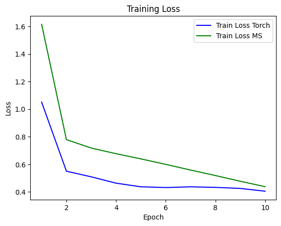
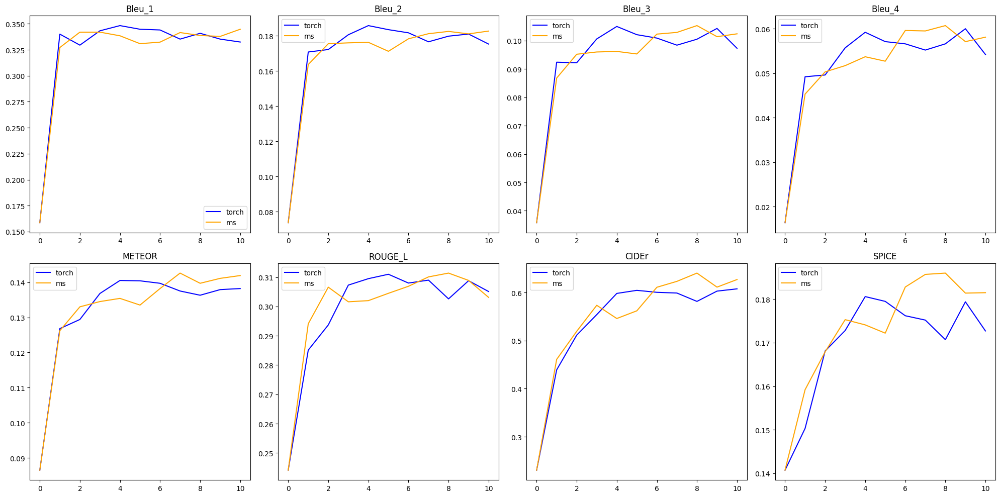

# FineTune Blip2-opt-2.7b with Food500Cap
- [base model: blip2-opt-2.7b](https://huggingface.co/Salesforce/blip2-opt-2.7b)
- [dataset: Food500Cap](https://huggingface.co/datasets/advancedcv/Food500Cap)
由于资源有限，训练集和测试集各取原来的1/8，即dataset = dataset.select(range(0, len(dataset), 8))

## code
- blip2_finetune_with_Food500Cap.py: mindspore下训练代码
- image_caption_eval.py: 评估脚本

## requirements
### mindspore
- Ascend 910B
- Python 3.9
- MindSpore 2.3.1
- MindNLP 0.4.1 (需要合入[mindnlp PR1958](https://github.com/mindspore-lab/mindnlp/pull/1958))
- tokenizers>=0.21.0 datasets

### pytorch
- GPU V100
- CUDA 11.8
- Python 3.10
- Pytorch 2.1.0
- Transformers 4.45.2
- tokenizers>=0.21.0 datasets accelerate

## train loss

## image caption eval
