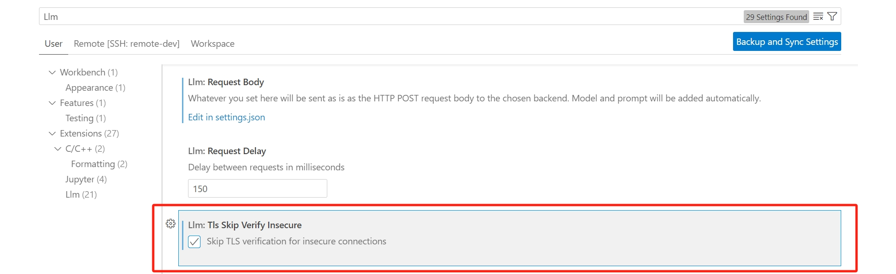
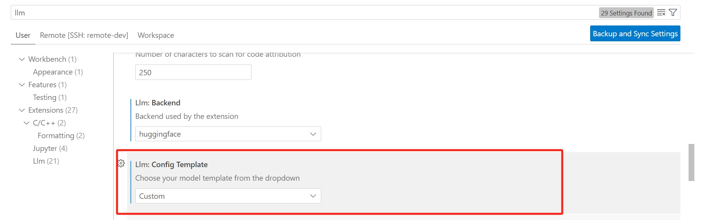

# StarCoder VSCode Endpoint Server

starcoder server for [llm-vscode](https://github.com/huggingface/llm-vscode) custom endpoint.

**Can't handle distributed inference very well yet.**

## Usage

1. **Environment setup**

    Run thw following command to set up the environment.

    ```shell
    pip install -r requirements.txt
    ```

2. **Install llm-vscode extension**

    Install llm-vscode extension as any other [vscode extension](https://marketplace.visualstudio.com/items?itemName=HuggingFace.huggingface-vscode).

    

3. **Run application on port**

    ```shell
    python main.py --pretrained bigscience/starcoder2-7b
    # use mirror if you cannot access huggingface
    python main.py --pretrained AI-ModelScope/starcoder2-7b --mirror modelscope
    ```

    It may take a while to download the model checkpoint for the first time. Please change the mirror address by `--mirror` argument if it takes too long.

4. **llm-vscode config**
    
    Search for `Llm` in vscode settings. 

    1) Select `Skip TLS verification for insecure connections`.
        
    
    2) Change `Llm:Backend` to `tgi` and `Llm:ConfigTemplate` to `Custom`.
        
    
    3) Select `Edit in settings.json` in `Llm:Url`.
        

        Change the configuration as follows:
        - Fill `http://localhost:8000/api/generate/` into `llm.url`
        - Change `max_new_tokens` to 20.

        

5. **Run code attribution**

    Type `Tab` to accept code suggestion.