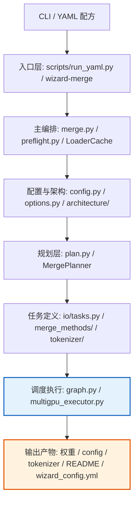

# MindNLP Wizard 模型合并模块

综合参考 [MergeKit](https://github.com/arcee-ai/mergekit)（Arcee AI）与 PaddleNLP 的相关工程实践，并面向 **MindSpore / Ascend NPU** 适配实现的同架构大模型权重合并引擎。

## 📐 设计思路

Wizard 的设计同时参考了业界已有 merge 工具的两类经验：一类是以 MergeKit 为代表的配方系统、任务拆解与合并方法设计，另一类是 PaddleNLP 在大模型工程落地中的实现经验。基于此，Wizard 面向 MindSpore / Ascend NPU 重新实现同架构模型合并能力，在尽量保留主流配方语义与执行思路的同时，补齐 `.ckpt`、dtype 安全等本地化工程支持。

### 核心设计原则

1. **优先兼容上游配方语义，控制实现分歧**
  - 在主流同架构合并场景下，尽量保持与 MergeKit 一致的 YAML 配方结构、方法语义与任务拆解方式
  - 对 MindSpore / Ascend 特有能力（如 `.ckpt`、多 NPU、dtype 安全）进行本地化扩展，而不是机械追求接口逐项等同
2. **dtype 安全优先**
  - MindSpore CPU 不原生支持 bfloat16/float16 算术，会静默提升为 float32
  - 引入 `dtype_policy` 模块统一处理：检测 → 提升 → 计算 → 还原
  - 对精度敏感的关键算子通过 `safe_ops` 封装，降低 half 精度在 CPU 路径上的数值风险
3. **统一懒加载**
  - 三种输入格式（safetensors / .bin / .ckpt）全部支持懒加载
  - 仅读取请求的张量字节，不加载整个文件到内存
4. **DAG 驱动，按需计算**
  - 每个张量的合并是一个独立 Task，通过有向无环图（DAG）描述依赖
  - Executor 按拓扑序执行，中间结果用完立即释放，峰值内存远低于全量加载
5. **格式中立的 I/O 抽象**
  - `TensorLoader` / `TensorWriter` 统一读写接口，上层代码不感知底层格式
  - 新增格式只需实现 Loader + Writer，不影响合并逻辑
6. **原创适配层与上游代码分离**
  - MergeKit 移植代码遵循 LGPL-3.0，Wizard 原创文件遵循 Apache 2.0
  - 原创模块集中在：`dtype_policy`、`safe_ops`、`preflight`、`io/_device`、`io/lazy_ckpt`、`eval/`
  - 许可证边界清晰，便于合规审查

## 📁 目录结构

```
src/mindnlp/wizard/
├── __init__.py
└── merge/
    ├── merge.py                  # 合并主入口 (run_merge)
    ├── config.py                 # YAML 配方解析
    ├── common.py                 # ModelReference 等公共类
    ├── options.py                # MergeOptions 运行选项
    ├── graph.py                  # Task DAG 与 Executor
    ├── plan.py                   # MergePlanner 合并计划生成
    ├── card.py                   # 模型卡生成
    ├── dtype_policy.py           # ★ dtype 安全策略（bf16 保护）
    ├── safe_ops.py               # ★ 安全张量运算
    ├── preflight.py              # ★ 合并前校验
    ├── sparsify.py               # 稀疏化（DARE/TIES 用）
    ├── multigpu_executor.py      # 多设备调度
    ├── architecture/             # 模型架构定义（50+ 种）
    ├── merge_methods/            # 20 种合并算法
    ├── io/                       # 张量 I/O
    │   ├── loader.py             # TensorLoader 统一加载
    │   ├── tensor_writer.py      # TensorWriter 统一写入
    │   ├── lazy_tensor_loader.py # 懒加载索引
    │   ├── lazy_unpickle.py      # .bin 懒加载
    │   ├── lazy_ckpt.py          # ★ .ckpt 懒加载
    │   └── _device.py            # ★ 设备移动
    ├── tokenizer/                # Tokenizer 合并
    ├── moe/                      # MoE 合并与构建
    ├── evo/                      # 进化搜索（CMA-ES）
    ├── tokensurgeon/             # Token 手术
    ├── eval/                     # ★ 评测后端（lm-eval-harness）
    ├── scripts/                  # CLI 脚本入口
    └── _data/                    # 架构 JSON 定义 / Chat 模板
```

> ★ 标记的文件为 Wizard 原创（Apache 2.0），其余移植自 MergeKit（LGPL-3.0）。

## 🚀 功能特点

- **MergeKit 配方兼容**：尽量保持与 MergeKit 一致的 YAML 配方语义，主流同架构合并配方可直接复用
- **多格式 I/O**：支持 safetensors / .bin / .ckpt 读取，safetensors / .ckpt 写入
- **统一懒加载**：全格式按需读取单个张量，降低内存占用
- **NPU 原生支持**：适配 MindSpore / Ascend NPU 推理与评测
- **dtype 安全**：bf16/fp16 在 CPU 上的精度保护，避免溢出与失真
- **20 种合并算法**：linear, slerp, ties, dareties, darelinear, modelstock, nearswap, karcher 等

## 📋 支持格式


| 方向  | safetensors | .bin (PyTorch) | .ckpt (MindSpore) |
| --- | ----------- | -------------- | ----------------- |
| 读取  | 单文件 + 分片    | 单文件 + 分片       | 单文件 + 分片          |
| 写入  | 单文件 + 分片    | —              | 单文件 + 分片          |


## 📊 架构设计

下面结合 `src/mindnlp/wizard/merge/` 的真实实现，复盘 Wizard 合并主链路的主要模块与调用关系。

### 总体架构

主调用链可以概括为：

`wizard-merge`
→ `scripts/run_yaml.py`
→ `merge.py: run_merge`
→ `preflight.py`
→ `architecture/`
→ `LoaderCache.setup() + loader warmup`
→ `MergePlanner.plan_to_disk()`
→ `TaskUniverse / build_schedule`
→ `Executor` / `MultiDeviceExecutor`
→ 写出权重、配置、tokenizer 与模型卡。




### 分层说明


| 层级          | 关键文件                                                                                                    | 真实职责与调用关系                                                                                                                                                                              |
| ----------- | ------------------------------------------------------------------------------------------------------- | -------------------------------------------------------------------------------------------------------------------------------------------------------------------------------------- |
| **CLI 入口**  | `scripts/run_yaml.py`                                                                                   | 定义 `wizard-merge` 命令，读取 YAML 文件，构造 `MergeConfiguration` 与 `MergeOptions`，然后调用 `run_merge()`。                                                                                           |
| **主编排**     | `merge.py` `preflight.py`                                                                               | `run_merge()` 是总入口：先做合并前校验，再识别架构、初始化 `LoaderCache`、预热各模型 loader、调用 `MergePlanner.plan_to_disk()` 生成根任务列表，最后交给执行器运行。                                                                    |
| **配置与架构**   | `config.py` `options.py` `architecture/`                                                                | `config.py` 定义 YAML 对应的数据模型与 `ConfigReader`；`options.py` 负责设备、输出格式、懒加载、多 NPU 等运行期选项；`architecture/` 根据模型配置识别架构并枚举 `WeightInfo`。                                                        |
| **规划层**     | `plan.py`                                                                                               | `MergePlanner` 按模块、层、张量展开配方，调用 `merge_methods.make_task()` 组织依赖链，并返回 `SaveTensor`、`FinalizeModel`、可选 `BuildTokenizer` 等根任务。规划层负责“构造任务”，不负责拓扑调度。                                        |
| **任务定义层**   | `io/tasks.py` `merge_methods/` `tokenizer/`                                                             | I/O 相关任务定义在 `io/tasks.py`；具体算法 Task 定义在各 `merge_methods/*.py`；tokenizer 相关任务定义在 `tokenizer/`。这些任务共同组成执行器要展开和执行的依赖图。                                                                    |
| **调度执行层**   | `graph.py` `multigpu_executor.py`                                                                       | `graph.py` 提供 `Task`、`TaskUniverse`、`build_schedule`、`Executor` 与中间结果回收；开启 `multi_npu` 时，主执行器切换为 `multigpu_executor.py` 中的 `MultiDeviceExecutor`。                                      |
| **精度与数值支撑** | `dtype_policy.py` `safe_ops.py`                                                                         | `dtype_policy.py` 负责 bf16/fp16 的工作 dtype 选择与精度策略；`safe_ops.py` 为 CPU half 相关敏感算子提供安全实现。这两者不仅服务算法层，也被预检和部分 I/O/稀疏化路径使用。                                                                 |
| **I/O 后端**  | `io/loader.py` `io/lazy_tensor_loader.py` `io/lazy_unpickle.py` `io/lazy_ckpt.py` `io/tensor_writer.py` | `io/loader.py` 是统一读取入口；`io/lazy_tensor_loader.py` 负责分片索引与张量路由；`io/lazy_unpickle.py` 处理 `.bin` 懒加载；`io/lazy_ckpt.py` 处理 `.ckpt` 懒加载；`io/tensor_writer.py` 负责 `safetensors` / `ckpt` 写出。 |
| **运行时与输出**  | MindSpore / Ascend NPU                                                                                  | 执行完成后，除模型权重外，`run_merge()` 还会保存 `config`、可选 tokenizer、模型卡 `README.md`、`wizard_config.yml`，并在需要时补齐附属文件。                                                                                 |


> `eval/mindspore_lm.py` 提供 lm-eval 的 MindSpore 后端，属于评测集成能力，不在合并主链路内。
> `moe/`、`evo/`、`tokensurgeon/` 也更适合作为扩展能力理解，而不是这条主合并路径的一部分。

### 核心组件


| 组件                 | 文件                     | 职责                         |
| ------------------ | ---------------------- | -------------------------- |
| MergeConfiguration | `config.py`            | YAML 配方解析，Pydantic 校验      |
| Architecture       | `architecture/`        | 自动识别模型架构（50+ 种）            |
| MergePlanner       | `plan.py`              | 将配方展开为根任务及依赖链              |
| Executor           | `graph.py`             | 展开任务依赖图、拓扑排序、按序执行、内存回收     |
| MergeMethod        | `merge_methods/`       | 20 种合并算法的统一抽象，并生成具体算法 Task |
| TensorLoader       | `io/loader.py`         | 多格式统一读取入口，由懒加载路由层调用        |
| TensorWriter       | `io/tensor_writer.py`  | 多格式统一写出（自动分片）              |
| dtype_policy ★     | `dtype_policy.py`      | bf16/fp16 精度保护策略           |
| safe_ops ★         | `safe_ops.py`          | CPU half 精度安全运算            |
| MindSporeLM ★      | `eval/mindspore_lm.py` | lm-eval MindSpore 推理后端     |


## 🛠️ 快速开始

### 1. 安装依赖

```bash
pip install -r requirements/requirements.txt
pip install -r requirements/wizard-requirements.txt
```

### 2. 编写合并配方

创建 `recipe.yaml`：

```yaml
models:
  - model: Qwen/Qwen2.5-7B
    parameters:
      weight: 1.0
  - model: Qwen/Qwen2.5-7B-Instruct
    parameters:
      weight: 0.5
      density: 0.5
merge_method: ties
base_model: Qwen/Qwen2.5-7B
parameters:
  normalize: true
dtype: bfloat16
```

### 3. 执行合并

```bash
# 方式 1: 模块调用
python -m mindnlp.wizard.merge.scripts.run_yaml recipe.yaml ./merged_model

# 方式 2: 包 CLI（安装后可用）
wizard-merge recipe.yaml ./merged_model

# 指定输出格式为 ckpt
python -m mindnlp.wizard.merge.scripts.run_yaml recipe.yaml ./merged_model \
    --output-format ckpt
```

### 4. 完整示例

`examples/wizard/llama3_biomed_dare_ties/` 提供了端到端的 DARE-TIES 合并复现案例
（Llama3-8B 医学合并），包含模型下载、合并执行、评测全流程。

合并后模型已上传至
[chenjingshen/Llama3-8B-merge-biomed-wizard](https://huggingface.co/chenjingshen/Llama3-8B-merge-biomed-wizard)。

更多配方模板见 `examples/wizard/`。

### 5. 合并产物

```
merged_model/
├── model-00001-of-00003.safetensors
├── model-00002-of-00003.safetensors
├── model-00003-of-00003.safetensors
├── model.safetensors.index.json
├── config.json
├── tokenizer.json
└── wizard_config.yml
```

## 🧪 测试

```bash
cd mindnlp

# 运行所有 Wizard 测试
pytest tests/mindnlp/wizard/ -v

# 运行单个测试
pytest tests/mindnlp/wizard/test_ckpt_io.py -v

# 查看测试覆盖率
pytest tests/mindnlp/wizard/ --cov=mindnlp.wizard --cov-report=html
```

## 📄 许可证

Wizard 的大部分代码移植自 [MergeKit](https://github.com/arcee-ai/mergekit)，遵循 **LGPL-3.0**。

Wizard 原创文件（`dtype_policy.py`、`safe_ops.py`、`preflight.py`、`io/_device.py`、`io/lazy_ckpt.py`、`eval/`）遵循 **Apache License 2.0**，与 MindNLP 项目许可一致。

## 📖 引用

如果使用了 Wizard，请引用上游 MergeKit 论文：

```bibtex
@inproceedings{goddard-etal-2024-arcees,
    title = "Arcee{'}s {M}erge{K}it: A Toolkit for Merging Large Language Models",
    author = "Goddard, Charles  and
      Siriwardhana, Shamane  and
      Ehghaghi, Malikeh  and
      Meyers, Luke  and
      Karpukhin, Vladimir  and
      Benedict, Brian  and
      McQuade, Mark  and
      Solawetz, Jacob",
    booktitle = "Proceedings of the 2024 Conference on Empirical Methods in Natural Language Processing: Industry Track",
    month = nov,
    year = "2024",
    publisher = "Association for Computational Linguistics",
    url = "https://aclanthology.org/2024.emnlp-industry.36",
    doi = "10.18653/v1/2024.emnlp-industry.36",
    pages = "477--485",
}
```

## 🤝 致谢

- **MergeKit**（Arcee AI）— 核心架构：Task DAG、YAML 配方系统、20 种合并算法、MoE、Evo、TokenSurgeon。LGPL-3.0 许可。
- **PaddleNLP**（Baidu）— 工程实践参考：大张量分块策略与 dtype 安全模式。未直接复制代码，仅参考设计思路。

## 🔗 相关链接

- [MindNLP 主仓库](https://github.com/mindspore-lab/mindnlp)
- [MergeKit 原始仓库](https://github.com/arcee-ai/mergekit)
- [Wizard 合并模型示例 (HuggingFace)](https://huggingface.co/chenjingshen/Llama3-8B-merge-biomed-wizard)

